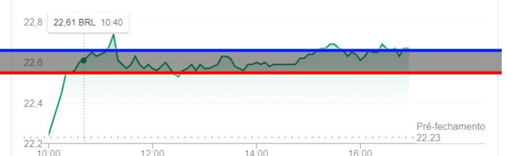

# INOA Desafio B

O objetivo do sistema é avisar, via e-mail, caso a cotação de um ativo da B3 caia mais do que certo nível, ou suba acima de outro.

O programa deve ser uma aplicação de console (não há necessidade de interface gráfica).

Ele deve ser chamado via linha de comando com 3 parâmetros.

O ativo a ser monitorado
O preço de referência para venda
O preço de referência para compra
Ex.

``` bash 
stock-quote-alert.exe PETR4 22.67 22.59
```

Ele deve ler de um arquivo de configuração com:

1. O e-mail de destino dos alertas
2. As configurações de acesso ao servidor de SMTP que irá enviar o e-mail

A escolha da API de cotação é livre.

O programa deve ficar continuamente monitorando a cotação do ativo enquanto estiver rodando.

Em outras palavras, dada a cotação de PETR4 abaixo.



Toda vez que o preço for maior que linha-azul, um e-mail deve ser disparado aconselhando a venda.

Toda vez que o preço for menor que linha-vermelha, um e-mail deve ser disparado aconselhando a compra.

# Solução

Para resolver o desafio, optei por usar a linguagem C#, e criei um Console app, utilizando a IDE Rider da JetBrains.

## Aplicação

A aplicação exige que um arquivo [.env](../main/env/.env) cujo modelo segue abaixo, seja criado na raiz do programa para que as informações da API e do SMTP sejam carregadas:

```
API_URL=
API_STOCK_PATH=

SMTP_SERVER=
SMTP_PORT=

SMTP_USER=
SMTP_PASSWORD=

SMTP_SENDER=
SMTP_RECEIVER=
```

Para rodar a aplicação execute o seguinte comando:
``` bash 
> ./StockQuoteAlert $ATIVO_DESEJADO $VALOR_VENDA $VALOR_COMPRA
```
Exemplos:

macOS/Linux
``` bash 
./StockQuoteAlert PETR4 22.67 22.59
```

Windows
``` bash 
StockQuoteAlert.exe PETR4 22.67 22.59
```

## Flask API

Depois de muita pesquisa achei uma biblioteca do python chamada yfinance que consegue obter o preço de um ativo da bolsa em tempo real, optei então fazer uma nova API para executar um script e obter o valor mais preciso.

Para implementar essa API decidi utilizar o Flask pois era uma API bem simples e rápida, sendo assim desnecessário utilizar um framework como Django.

Para rodar a API basta executar:

``` bash
pip install -r requirements.txt
flask run -h localhost -p 5132
```

## Mock API

Primeira procurei uma API gratuita que eu pudesse utilizar para a tarefa porém não consegui encontrar nenhuma que fosse gratuita e sem limites de requisições, por tanto decidi criar uma MockAPI com dados extraidos da bolsa, para poder testar a aplicação.

Para isso também utilizei C# e criei uma WebAPI simples, cujo endpoint me inspirei no da HGBrasil.

Também tive problemas para encontrar um dataset que tivesse com variações diárias, só consegui encontrar dados com os valores de abertura, fechamento, minimo e maximo de um dia, sendo assim decidi criar um [script](../main/scripts/txttocsv.py) em python que lia esses dados para criar um dataset com os dados de cada ação para pelo menos um dia do mês de 1 a 31 garantido que independente do dia que o programa executar retornara um valor para o ativo.

Dados obtidos de:

> http://bvmf.bmfbovespa.com.br/InstDados/SerHist/COTAHIST_A2023.ZIP

O script pode ser rodado da seguinte forma:

``` bash 
python txttocsv.py < COTAHIST_A2023.TXT
```

Para calcular o valor e criar uma variação artificial implementei uma lógica que randomiza o preço fazendo ele variar entre o minimo e o maximo do dia em que ocorreu.

## Detalhes da Implementação

Para criar a aplicação utilizei o pattern do Observer que pode ser encontrado nos seguintes links:

> https://refactoring.guru/design-patterns/observer

> https://refactoring.guru/design-patterns/observer/csharp/example

Assim a aplicação se separa em duas partes:

1. Lê os argumentos passados, realiza as validações necessárias e prepara as classes necessárias para o funcionamento da aplicação.

2. Rotina executada a cada 1 minuto que realiza uma requisição HTTP para obter o preço atualizado do ativo e então verificar se o valor ultrapassa um dos limites desejados, enviando um e-mail em caso positivo.